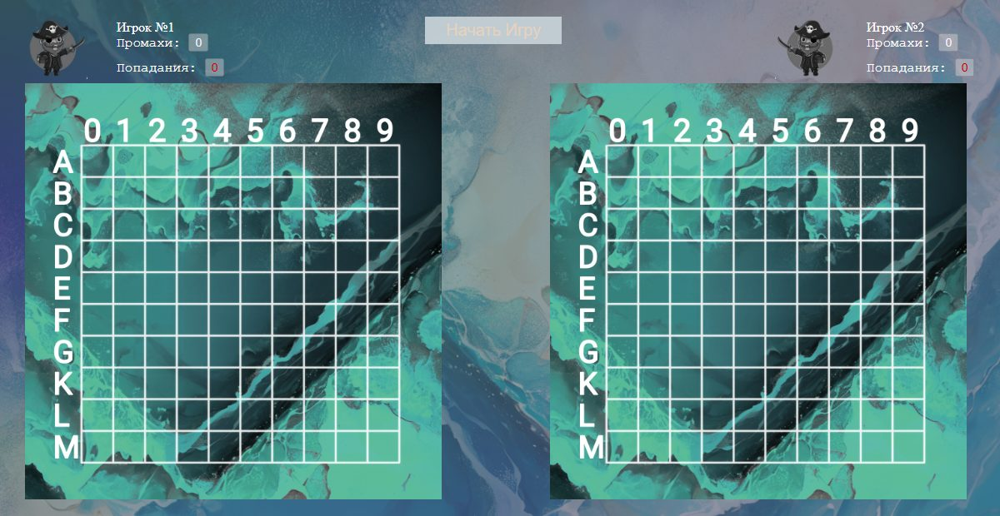

# WaterWonderfulBattle

A two-player **Battleship** game for the browser, written in plain JavaScript, HTML and CSS with no frameworks or libraries.

## Gameplay

- Two players, each with their own 10×10 board (rows A–M, columns 0–9) and a hits / misses counter.
- Players take turns entering target coordinates (e.g. `A0`, `D7`, `L3`).
- The game reports hits, misses and sunk ships, validates the input and announces the winner once all ships of one side are sunk.

## How to run

No build step and no server needed: open `index.html` (or `ds copy.html`) in any modern browser.

## Code structure

The game logic is split into numbered modules, loaded in order. Files with the `_pc` suffix hold the same logic for the second player.

| Module | Responsibility |
|---|---|
| `blocks/1_view.js` | Rendering: board cells, messages, hits and misses |
| `blocks/2_model*.js` | Game state: ships, shot / hit / miss counters |
| `blocks/3_any*.js` | Random ship placement and coordinate checks |
| `blocks/4_near_position*.js` | Placement rules: excluding cells next to already placed ships |
| `blocks/4.5_start_play().js` | Starting, stopping and restarting the game |
| `blocks/5_control*.js` | Input handling, coordinate parsing and validation |
| `blocks/6_near_shots*.js` | Marking cells around hit ships |

The layout and styles are in `ds copy.html` and `ds copy.css`, with images in the repository root.

## Tech stack

JavaScript (ES5) · HTML5 · CSS3

## License

[MIT](LICENSE)
